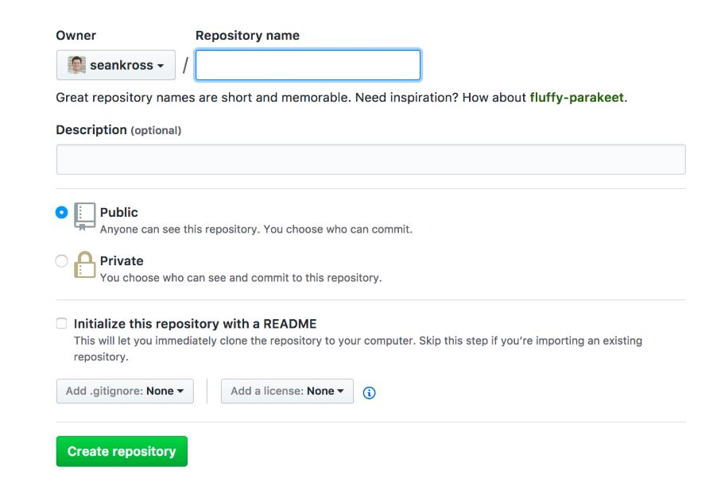

## Let's Connect!  
Now that you have Git installed and configured and created a GitHub account, make sure you can pull and push 
to GitHub from your computer. 
**IMPORTANT** You will be cloning repositories down to your local computer. For good organization and accessiblity, create a top
level directory on your laptop now. Call it DCS210 so that you will be able to easily locate your projects.
    
### Exercise 1: Create your first repo
Assumed Knowledge: create a directory, edit a file, basic shell commands
#### Create a directory

Navigate to your DCS210 directory

	cd /yourpathto/DCS210
	mkdir my-first-repo
Create a simple text file:

	echo "Welcome to My First Repo" > readme.txt

#### Using git to create a local repo [Getting Started with Git](https://seankross.com/the-unix-workbench/git-and-github.html#getting-started-with-git)  

	git init
	git status
	git add 
	git status
	git commit -m  "this is my first commit"
	git status
	
#### Summary of basic commands used 

| Command         | Notes |
| --------------- | ------ |
|git status| your best friend! use it often|
|git init| start tracking files with git|
|git add | staging|
|git commit | aka 'logging your changes'; aka 'creating a milestone'|
|git add -A | track all of the files in our directory |
|git help 'git command'| e.g., git help status; find out all you need to know about the command|
|git rm --cached filename| command to remove a file from stage __before__ a commit|

### Questions:
1. What is the difference between a tracked and untracked file?
2. What is the importance of the -m option on teh git commit command?

### Exercise 2: Using GitHub to create a remote repo
To get started, sign in to your GitHub acccount with the credentials you setup earlier

__Note__ that you have a *local* git repository in your DCS210 folder; why is there not a repository named my_first_repo in your GitHub account?

#### Follow the instructions [Getting Started with GitHub](https://seankross.com/the-unix-workbench/git-and-github.html#github) 

#### Points to Ponder along the way
* create repo
	* public vs. private
	* initialize with README
	* add .gitignore
* GitHub suggestions
	* Quick setup = clone
	* the 'remote' = 'origin'

__Getting Connected!__ - In terminal or gitBash, navigate to your DCS directory

	git remote
	git remote add origin https://github.com/yourusername/my-first-repo.git 
	git push -u origin master 

#### Summary of basic commands used 

| Command         | Notes |
| --------------- | ------ |
|git remote|  |
|remote add origin url | url = address of your repo in GitHub; adds a new remote named 'origin' to your __local__ repo |
|git push -u origin master | initial setup of remote; -u sets origin as the default remote repository|

### Questions
1. Look back at your web page for your repository on GitHub (you may need to refresh the page); do you see anything different?
2. To what do the names origin and master refer?
3. How would you modify your repo and submit the changes to your repo?

### Exercise 3 Accept Assignment