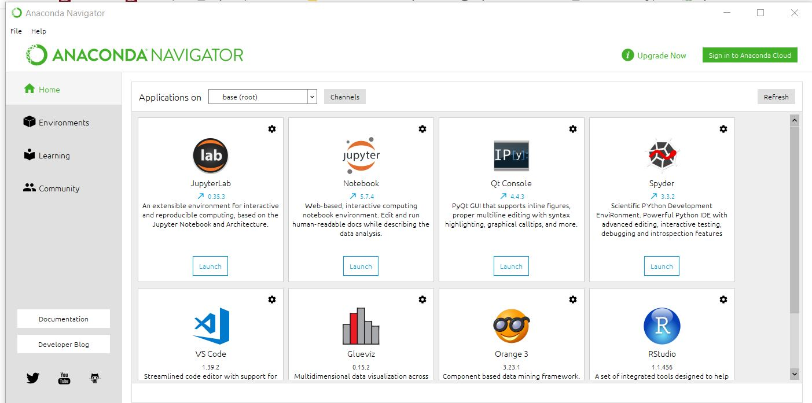
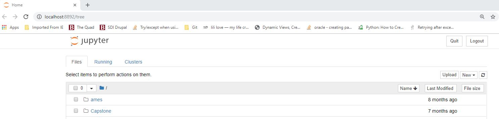

# Installation and Setup Checklist

This is a checklist to confirm that your laptop is set up properly for DCS 210. If at any point you get an error message, please note the error message and we will help you to fix it! 
If you don't get any error messages, you are properly set up.

Please post a message in the "setupchecklist" channel in Slack once you have walked through the entire checklist. That way, we will know whether or not we need to follow up with you.

## Install

### Anaconda
* Install the [Anaconda distribution](http://continuum.io/downloads) of Python 3.7x. This is a good installation guide [here](https://www.datacamp.com/community/tutorials/installing-anaconda-windows) 
that you should read first for the basics. The videos below are OS specific and very much worth watching!
	* For Windows, go [here](https://www.youtube.com/watch?v=dgjEUcccRwM); he has a blog post [here](https://medium.com/@GalarnykMichael/install-python-on-windows-anaconda-c63c7c3d1444) as well.
	__NOTE__: Be sure to set your path in the command prompt
	* For Mac, go [here](https://www.youtube.com/watch?v=YJC6ldI3hWk)

### Github

* Create a [GitHub](https://github.com/) account.

### Slack
* For Windows: https://slack.com/downloads/windows
* For Mac: https://slack.com/help/articles/207677868-download-slack-for-mac#app-store-1

## Verify

### Anaconda Navigator  
Launch __Anaconda Navigator__ 
* in Windows, go to the the Windows start menu and select Anaconda Prompt under Anaconda3
* on Mac, 

	
You should see, at a minimum, the following packages installed:
* Spyder
* Jupyter Notebook

Launch __Jupyter Notebook__ from Anaconda Navigator 
This is a hosted application and will open in your default browser. You will not see the folders as in the image but will be creating some of your own

### Anaconda Prompt Setup
Because this course must support both Mac OS and Windows, I've settled upon using the Anaconda shell for consistency between both operating systems.
The default shell in all versions of Mac OS is bash (although, I believe Catalina will be delivered with zsh as the default). Windows users would typically download something like Cygwin or Git Bash. But since we are 
installing Aanaconda, the Anaconda prompt will provide a common linux environment for both sets of users.

The Anaconda prompt window is __both__ a package manager and environment manager (similar to Python's venv).
Executing the command as shown below will set the environment to work similar to Terminal on the Mac and PowerShell on Windows.
(PowerShell is Windows version of the Mac Terminal - they are both essentially bash shells - but this is more than you need to know at the moment!)

You can read more about [Anaconda Environments](https://docs.conda.io/projects/conda/en/latest/user-guide/tasks/manage-environments.html)
but we will go over the basics in class.

#### Open an Anaconda Prompt
Execute the following command at the prompt (\path\your user name>):

`conda create --name myenv m2-base jupyter`

This will create a conda environment that allows you to use linux commmands and run jupyter notebook from the command line.

To activate the environment use:`conda activate myenv`

To deactivate the environment and return to the default use: `conda deactivate`

### Python Interpreter
In the Anaconda prompt window at the prompt > type:

`python version`

    
To run the python interpreter type: `python`     
(You know you are in the interactive interpreter because the prompt looks like >>>)

Now type: `import this`

What do you see??
	
To exit the interpreter type: `exit()` 

### Slack
* slack me with success or issue!

