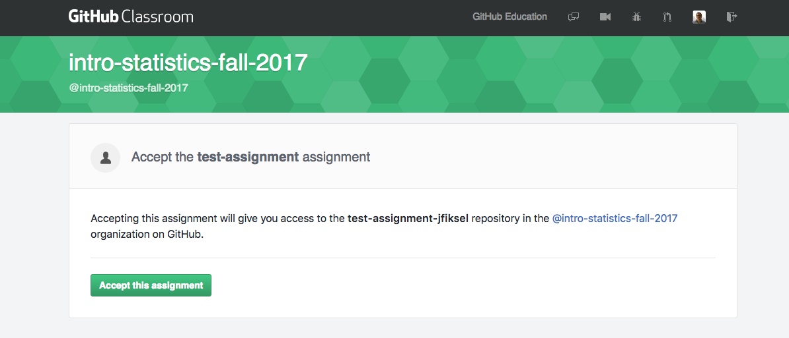

# Overview - concepts covered
* git
* GitHub
* GitHub Classroom
* Markdown??

# Git Configuration and Github Setup

**IMPORTANT: We will be using Github Classroom for assignment submission. It is important this be setup correctly and that you are comfortable with the 
concepts of source control and remote repositories**

## What is Git?
Git is an open-source version control system and collaboration tool. It is a command line tool which allows
you to track versions of any code or plain text documents that you create. Git organizes groups of files that
you are working with into **repositories** which is jsut a directory where all the changes to files in that
directory are tracked.

Check out the [Getting Started](https://git-scm.com/book/en/v2) section of the documentation for 
a more elaborate description. For this class we will only touch on  very basic git comamands for sharing code 
and homework submission.  

## What is GitHub?
Well the authoritative answer is [here](https://git-scm.com/book/en/v2/GitHub-Account-Setup-and-Configuration). But basically it is a Web-based graphical interface for 
interacting with Git. GitHub is a Git repository hosting service (i.e it provides access to remote Git repositories), 
but adds many of its own features. The flagship functionality of GitHub is "forking" - copying a repository
from one user's account to another. This is the main feature we will be using to share class notes and assignments with you. 

Repositories can be public or private. **For this class, all repositories will be private**.
 

## What is GitHub Classroom?
GitHub Classroom is a teacher-facing tool that supports the 'forking' of repositories to students in the classroom. 
It is not an integrated feature of GitHub but a separate application which supports the use of GitHub in the classroom.
For the most part GitHub classrooom will be invisible to you but I mention it should the term pop-up!

## Steps for Getting Started with GitHub

**1. Get Your GitHub Account**
* You will need to register for a github account if you don't already have one
* We recommend using a username that incorporates our name
* Visit https://github.com, choose a user name that isn’t already taken, provide an email address and a password, 
and click the big green “Sign up for GitHub” button. 

**2. Installing Git**
* You should already have git installed from the Anaconda installation.
* In the Anaconda command prompt, type `which git` to confirm git is installed; you should see the path to the git executable listed.
 

**3. Setup options in Git**
* Open the Anaconda command prompt:
    

	**a. Configure your global git user name and email settings**
	 1. Type `git config --list` 
	 to see your current git configuration settings. 
	 (__Note__: at the : you can type enter to see more or Q to quit). What is the __user.name__ setting? What is the __user.email__ setting? Next, we will configure git to use your github user name and email address.
    2. Type `git config --global user.name "YourFirstName YourLastName"` (including the quotes)
    3. Type `git config --global user.email "youremail@domain.com"` (use the email address associated with your GitHub account)
    4. Type `git config --list` again. Those setting should be updated to match the config changes you just made. Note that you can also check an specific setting by typing `git config --global` with no argument.
  
	**b. Generate a SSH key so you don't need to enter your pwd every time you interact with GitHub**
  1. First check to see if you have an SSH key. Complete [this page](https://help.github.com/en/github/authenticating-to-github/checking-for-existing-ssh-keys)

## Downloading, editing and submitting assignments from GitHub Classroom
The steps for accepting and submitting a homework assignment will be clear after you have completed exercises 1 - 3 in the Lab
for Session 1. The basic steps are as follows:
* Accept the assignment (assignment repo is automatically __'forked'__ to your repo in GitHub)
* __Clone__ the assignment repo to your local machine
* __Commit__ your changes early and often!
* Submit your work by .... Create a pull request ?? optional?

### Detailed Steps
Each class you will be given an 'assignment link' which will automatically fork the assignment repo to your
repo. You will then 'clone' the repo to your local machine. You will want to keep your assignments well organized 
so please follow the directory structure recommended in the next steps.

1. __Manageing__ your 'clone' army
* Create a folder specifically for this class. Call it DCS210.
* Within this folder create __three__ more folders: Lectures, Labs, Homework

	__Challenge__: create these folders from the shell environment (aka Anaconda Prompt window!) using the CLI commands; review the basics [here](https://seankross.com/the-unix-workbench/command-line-basics.html)

	| Command | Notes |
	| ------- | ----- |
	|pwd| present workding directory|
	|ls| list files/directories in the current directory|
	|cd| change directory|
	|mkdir| make directory|
	| cd .. | back up one directory level|

2. __'Forking' the repo__ A link to an assignment will be posted to Slack. This will happen for each new assignment. When you click
on the assignment link an assignment repository is 'forked' to your repo with your username as part of the repository name. 
Here is an image of what you should see after clicking the link:
 
?? Accepting the assignment should bring you to your repo??

3. Click __“Clone or Download”__, 
and choose  'Clone with HTTPS' The link is now copied to your clipboard.

5. In Anaconda Prompt, type  `git clone repo-link` (replacing __repo-link__ with the URL in your clipboard).
You have now cloned the assignment repo from the remote to your local directory.

6. After you make changes to the homework assignment, commit them. 
__Note:__ commit early and often with useful commit messages. At a minimum commit each time you have completed a question. 

7. When you are ready for feedback, use __git push__ to push your changes up to the remote from your local directory.

# Workflow employed by the instructor:
## Feedback during assignments:

* Clone the student’s directory to their own computer. Or pull the latest changes if the repository has been previously cloned.

* Provide feedback through either a pull request, directly into the code, or as an issue in GitHub.

* Push all changes back to GitHub.

All feedback is then documented in the commit history, which can be a useful reference if the student wants to look back at the assignment after completion.

## Grading Workflow
* Clone all student assignment repositories to a local computer using GitHub Classroom mass clone tool

* Open each student’s assignment (all assignments can be opened simultaneously with a single command on the terminal command-line), and run the code inside of RStudio to ensure reproducibility. Add comments, suggestions, or edits within each student’s .R script or .Rmd file and save the altered file.

* Use the shell script in step 1 to simultaneously add, commit, and push all edits for all student assignments. This step is done with one line of “command line” code, and students can view highlighted comments by visiting their assignment repository on GitHub and clicking on the commit (Figure 5), or by pulling the latest version of the repository.

Fig. 5 Students see instructor feedback in GitHub. After an instructor has provided feedback in a student’s assignment, the instructor then commits the feedback and pushes the updated file to the student’s assignment repository. By clicking on the commit message, the student then sees the feedback given by instructors, which is highlighted in green.
## Resources
* [The Unix Workbench](https://seankross.com/the-unix-workbench/)
* [GitHub Guides](https://guides.github.com/)
* [Using GitHub for Classroom (video)](https://www.youtube.com/watch?v=_b67gwTXJkE)

